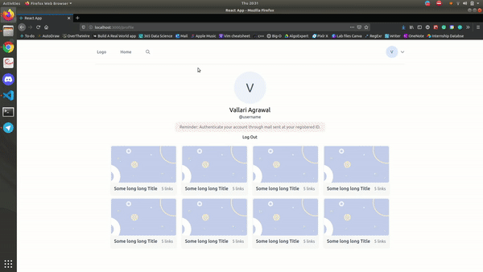
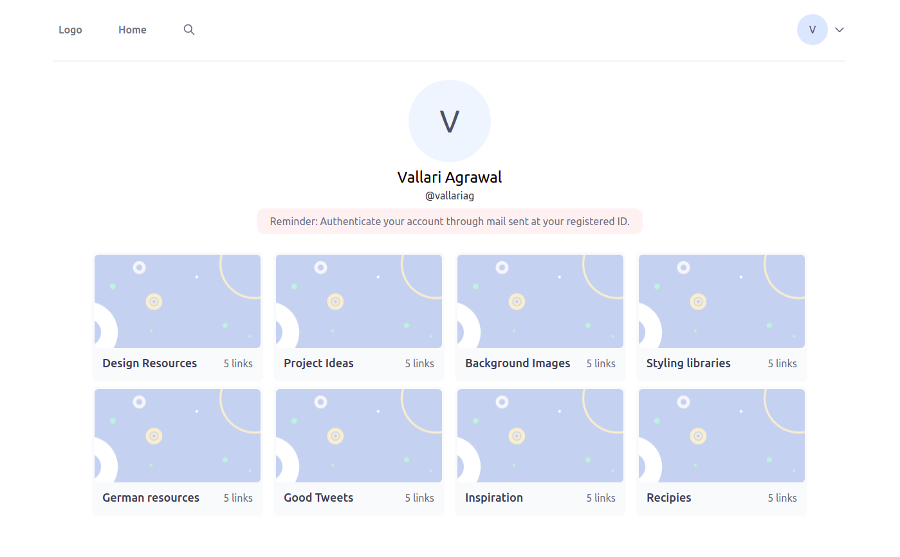
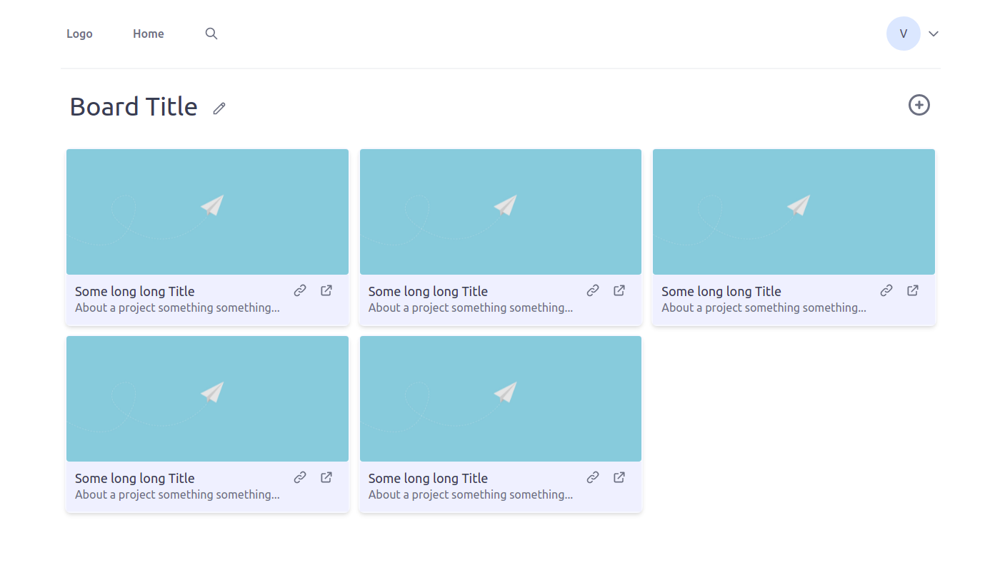
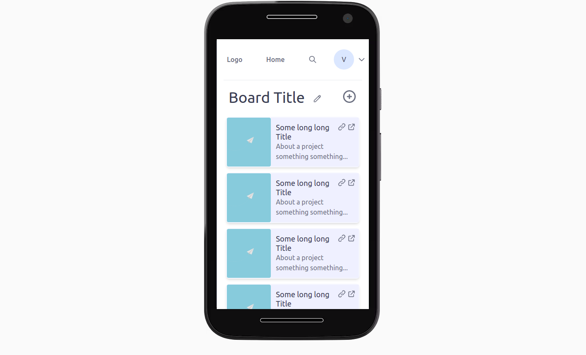

# Warehouse

(WIP)
Store links and resources in an organzied way.




# Install

Install `npm`, and (at the root of the repository) run:
```
npm install
```

# Use

Categorize.




Store your links:




